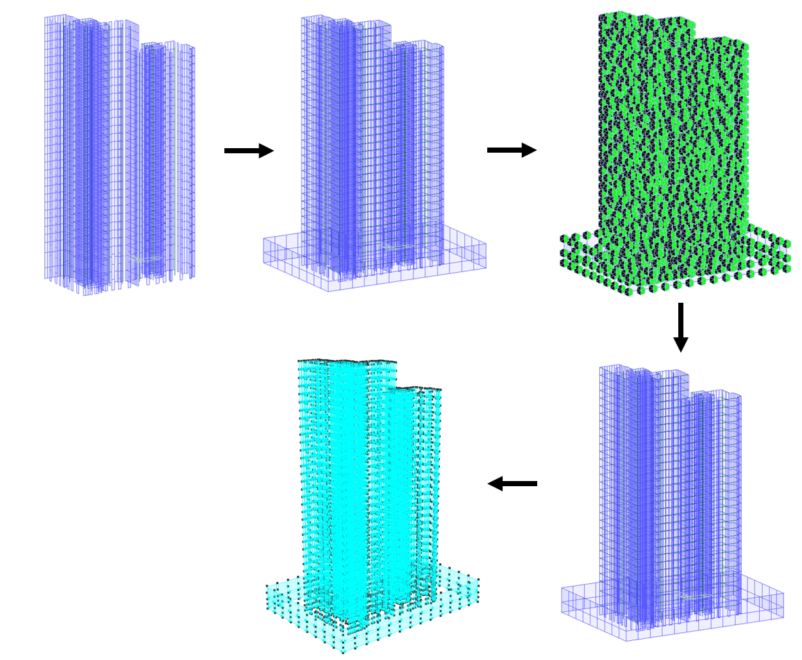

===============================================================
레퍼런스 모델 생성
===============================================================

.. only:: html
   
   :bdg-danger:`Midas GEN`

해외 프로젝트를 제외하면 대부분의 프로젝트에서는 탄성설계를 Midas Gen으로 진행합니다. 반면, 저희가 성능설계 모델링에 사용할 프로그램은 Perform-3D입니다.
따라서 Midas Gen에서 Perform-3D로 모델링 정보를 변환하는 과정이 필요한데, 두 프로그램은 엄연히 다른 프로그램이기 떄문에 모든 정보를 변환할 수 없습니다.
다만 탄성설계 모델을 최대한 다듬고 수정하여 변환한다면, 최대한 많은 정보들을 변환할 수 있습니다. 
또한 모델 정보를 다른 프로그램으로 옮기는 과정이 올바르게 진행되었는지 검증하는 과정도 필요합니다.

이와 같이 **최종모델(성능기반 내진설계 모델)을 생성하는 과정에서 만들어지는 모든 중간단계의 모델**\을 통틀어 레퍼런스 모델이라고 지칭하였습니다.

   
   *탄성설계 모델 - 지진파산정 모델 - 정보변환 모델 - 주기검토 모델 - 성능설계 모델*

.. rubric:: 탄성설계 모델

탄성설계 모델은 **탄성설계 과정에서 사용된 최종 Midas Gen 모델**\입니다. 

.. rubric:: 지진파산정 모델

지진파 산정 모델은 **지진파 산정 의뢰를 위해 제출해야하는 Midas Gen 모델**\입니다.
탄성설계 모델을 성능설계 모델로 변환하는 과정 중에 가장 먼저 생성되는 모델입니다.

.. rubric:: 정보변환 모델

정보변환 모델은 **하중을 제외한 모든 정보를 Perform-3D로 변환하기 위한 Midas Gen 모델**\입니다.
하중변환 모델과 정보변환 모델은 Perform-3D로 Import하기 위한 최종 정보가 포함된 모델이기때문에, 
이 두 모델이 정확하지 않으면 성능설계 모델도 부정확하게 모델링될 수 있습니다.

지진파산정 모델에서 몇가지 설정만 변경하여 정보변환 모델을 생성할 수 있습니다.

.. rubric:: 주기검토 모델

주기검토 모델은 **탄성설계 모델의 정보가 성능설계 모델에 정확하게 반영되었는지 비교 검증하기 위한 모델**\입니다.
주기 외에도 모드형상, 질량참여율, 밑면전단력 등을 비교합니다.

.. rubric:: 성능설계 모델

성능설계 모델은 **성능기반 내진설계에 필요한 Perform-3D 모델**\입니다.
하중변환 모델과 정보변환 모델을 기반으로 생성되며, 자세한 내용은 :doc:`모델링 <3_modelling>` 장에서 다뤄집니다.

.. raw:: html

   지진파산정 모델과 레퍼런스 모델의 생성 과정은 아래의 단계를 거칩니다.

.. toctree::
   :maxdepth: 1
   :caption: STEPS

   1_unit_setting
   1_material_setting
   1_base_wall
   1_support_setting
   1_stiffness_setting
   1_mass_ecc_setting
   1_seismic_wave_request_model
   1_loads_conversion_model   
   1_period_check_model

